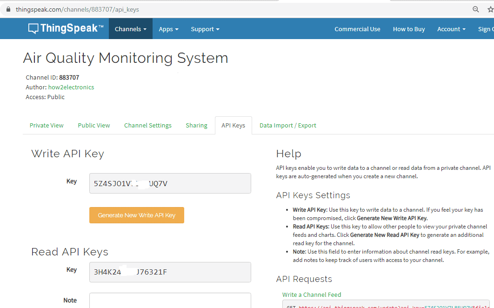

# IoT Мониторинг загрязнения/качества воздуха

## Идея

Этот проект представляет собой инновационную систему мониторинга загрязнения воздуха с использованием технологии Интернета вещей (IoT). Система, которая будет способна непрерывно отслеживать концентрации основных газов, загрязняющих атмосферу, и предоставляющая эту информацию в режиме реального времени через интернет. Это позволит не только контролировать уровень загрязнения воздуха, но и улучшить экологическую ситуацию в городах.
Кроме того, система поможет продлить срок службы устройств и уменьшить потребление энергии. Например, система может автоматически выключать датчики в периоды, когда качество воздуха стабильно хорошее, и активировать их только при обнаружении повышенных уровней загрязнения. Таким образом, система сможет снизить затраты на энергопотребление и продлить срок службы устройств, что будет выгодно как для нашей компании, так и для окружающей среды.
Кроме этого, система будет иметь возможность сбора дополнительных данных о состоянии окружающей среды, таких как температура, влажность и давление, что позволит более точно оценивать экологическую ситуацию в городах и принимать меры по ее улучшению.

## Функциональность:

В системе используются 3 датчика, такие как датчик твердых частиц [PMS5003 PM2.5](https://github.com/jbanaszczyk/pms5003/blob/master/doc/pms5003-manual_v2-3.pdf), датчик качества воздуха [MQ-135](https://portal-pk.ru/news/285-mq135-datchik-uglekislogo-gaza-biblioteka-mq135-arduino-library.html), датчик атмосферного давления [BME280](https://kit.alexgyver.ru/tutorials/bme280/).

Собранные данные передаются на сервер Thingspeak, где они агрегируются и хранятся. Это позволяет пользователям получать доступ к этим данным в любое удобное для них время и из любой точки мира через компьютер или мобильное устройство. Кроме того, данные могут быть использованы для более глубокого анализа и исследования. Возможно, вы захотите изучить определенные тенденции или сравнить данные с другими источниками. Наконец, собранные данные могут быть использованы для создания дополнительных сервисов и продуктов на основе анализа поведения пользователей и их потребностей. В целом, собранные данные могут стать ценным источником информации для различных целей и задач, и использование их может принести множество пользы для пользователя.

Система предложит пользователям систему уведомлений, которая позволит им быть в курсе актуальных значений загрязнения воздуха. Система будет автоматически отправлять сообщения, если уровень загрязнения превысит пороговые значения. Таким образом, пользователи смогут получать предупреждения и предостережения о возможных опасных условиях, и принимать необходимые меры для защиты своего здоровья и безопасности. Система также предоставим пользователям подробную информацию о воздействии загрязнения на здоровье и рекомендации по минимизации рисков. В результате, система уведомлений станет надежным помощником в поддержании здоровья и благополучия наших пользователей.

Важно не только собирать данные о качестве воздуха, но и длительное время их хранить и анализировать. Это позволит более точно определить тенденции изменения качества воздуха, а также выявить потенциально опасные факторы влияния на окружающую среду. Кроме того, на основе долгосрочного анализа данных можно будет разработать более эффективные меры по улучшению качества воздуха в будущем. Например, внедрить новые технологии очистки воздуха или проводить профилактические работы на объектах, которые являются источниками загрязнения воздуха. Таким образом, хранение и анализ данных о качестве воздуха на долгосрочной основе является важным шагом для повышения экологической безопасности и улучшения экологической ситуации в целом.

## Необходимые технологии:

Ниже приведены компоненты, необходимые для создания **системы мониторинга загрязнения воздуха / качества на основе IoT**.

| #   | Название компонентов      | Описание                                                                              |
| --- | ------------------------- | ------------------------------------------------------------------------------------- |
| 1   | NodeMCU ESP8266 Board     | Микроконтроллер, который обеспечивает связь с Wi-Fi и управление датчиками.           |
| 2   | PMS5003 PM2.5/PM10 Sensor | Датчик твердых частиц PM2.5, который измеряет содержание мельчайших частиц в воздухе. |
| 3   | MQ-135 Air Quality Sensor | Датчик качества воздуха, который обнаруживает различные вредные газы.                 |
| 4   | BME280 Sensor             | Датчик атмосферного давления, влажности и температуры.                                |
| 5   | Соединительные провода    | Для подключения датчиков к микроконтроллеру.                                          |
| 6   | Макетная плата            | Для удобной сборки и подключения компонентов.                                         |

### PMS5003 Датчик твердых частиц PM2.5

Plantower PMS5003 — это лазерный счетчик частиц. PMS5003 является цифровым и универсальным датчиком концентрации частиц, который может быть использован для получения количества взвешенных частиц в воздухе, т.е. концентрации частиц, и вывода их в виде цифрового интерфейса. Этот датчик может быть вставлен в переменные приборы, связанные с концентрацией взвешенных частиц в воздухе или другое оборудование для улучшения окружающей среды, чтобы своевременно предоставлять правильные данные о концентрации.

### Датчик качества воздуха MQ-135

Датчик газа MQ-135 обнаруживает такие газы, как аммиачный азот, кислород, спирты, ароматические соединения, сульфиды и дым. Газовый датчик MQ-3 имеет более низкую проводимость для очистки воздуха в качестве газочувствительного материала. В атмосфере мы можем найти загрязняющие газы, но проводимость газового датчика увеличивается по мере увеличения концентрации загрязняющего газа. Датчик газа MQ-135 может быть реализован для обнаружения дыма, бензола, пара и других вредных газов.

### Датчик атмосферного давления BME280

Датчик влажности, температуры и давления Bosch BME280 - это встроенный датчик окружающей среды, который имеет очень маленький размер и низкое энергопотребление. BME280 - это простой способ измерения барометрического давления, влажности и температуры, не занимая слишком много места.

## Настройка Thingspeak

Нужно настроить учетную запись [Thingspeak](https://thingspeak.com/) для мониторинга данных из Nodemcu ESP8266-12E в Интернете.

После создания учетной записи необходимо создать новый канал, заполнив следующие данные:

Остается скопируйте ключ API записи и внесите изменения в Arduino

## Варианты замены технологий:

Возможно вместо использования Wi-Fi для передачи данных, можно рассмотреть Bluetooth:

- Bluetooth: Вместо Wi-Fi можно использовать Bluetooth для передачи данных на более короткие расстояния. 👍🏻👍🏻👍🏻

- Камеры и обработка изображений: Для мониторинга качества воздуха можно также использовать камеры и алгоритмы обработки изображений для анализа атмосферных условий. +-

- Лора (LoRaWAN): Вместо Wi-Fi или Bluetooth можно использовать технологию LoRaWAN для передачи данных на большие расстояния с низким энергопотреблением. Это может быть полезно для мониторинга качества воздуха в удаленных или труднодоступных местах.

## Сценарии использования:

1. **Городской мониторинг**: Система может быть развернута в разных частях города и обеспечивать непрерывный мониторинг качества воздуха. Система может предоставить данные с целью улучшения экологической обстановки для городских властей. Благодаря этим данным городские власти смогут принимать более обоснованные решения в области экологии и здравоохранения.

2. **Пользовательский мониторинг**: Люди могут использовать систему для мониторинга качества воздуха в их районе и принимать решения о том, когда лучше всего проводить активности на свежем воздухе. Система может предоставить пользователям дополнительную информацию о качестве воздуха и конкретных факторах, которые могут оказывать на него влияние. Это поможет людям принимать обоснованные решения для сохранения и улучшения своего здоровья и благополучия.

3. **Медицинские исследования**: Данные, собранные системой, могут быть использованы для проведения медицинских исследований и оценки воздействия загрязнения воздуха на здоровье человека. Это может помочь установить связь между различными факторами загрязнения и конкретными заболеваниями, а также выявить группы риска и разработать соответствующие меры по защите здоровья населения. Данные также могут использоваться для проведения более точных и качественных медицинских исследований в будущем, что, в свою очередь, позволит разработать более эффективные стратегии борьбы с загрязнением воздуха и защиты здоровья людей.

## Ограничения:

- Система зависит от доступности Wi-Fi или альтернативных средств связи.

- Датчики могут требовать периодической калибровки и обслуживания, чтобы обеспечить точность данных.

- Пользователи могут нуждаться в технической поддержке при установке и настройке системы

## Физические принципы:

Проект основан на принципах сбора данных с датчиков, измеряющих параметры воздуха, и передачи этих данных через Wi-Fi (или альтернативные технологии) на удаленный сервер для анализа и хранения.

Этот проект демонстрирует потенциал IoT-технологий в области экологического мониторинга и предоставляет возможность для лучшего понимания качества воздуха в разных частях города или региона.

# Пруфы

Сборка такой системы - [ https://www.youtube.com/watch?v=NtsbqxyqvGw&ab_channel=HowToElectronics ]

PMS5003 PM2.5 - [ https://github.com/jbanaszczyk/pms5003/blob/master/doc/pms5003-manual_v2-3.pdf ]

MQ-135 - [ https://portal-pk.ru/news/285-mq135-datchik-uglekislogo-gaza-biblioteka-mq135-arduino-library.html ]

BME280 - [https://kit.alexgyver.ru/tutorials/bme280/ ]

Примеры мониторинга на сервере Thinspeak - [https://thingspeak.com/channels/public?tag=Air%20Quality%20Monitoring]
