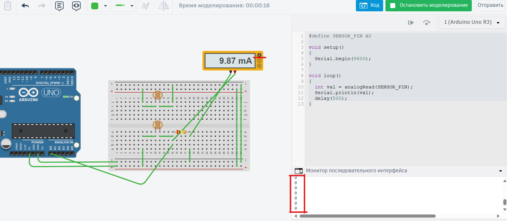
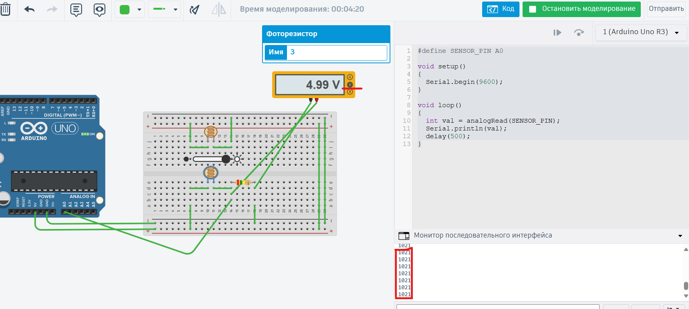

### Проверьте две гипотезы относительно носителя сигнала для микроконтроллера:

1. Носителем сигнала является ток (изменения силы тока влияет на показания, считываемые контроллером)

2. Носителем сигнала является напряжение (изменения напряжения влияет на показания, считываемые контроллером)

```C
#define SENSOR_PIN A0

void setup()
{
  Serial.begin(9600);
}

void loop()
{
  int val = analogRead(SENSOR_PIN);
  Serial.println(val);
  delay(500);
}
```

Код, с которым мы работаем будет циклически считывать аналоговый сигнал с пина A0 и выводить его значения на Serial Monitor 

## Носителем сигнала является не ток

Когда силу тока на мультиметре, контроллер видит отсутствие изменения напряжения на этом пине и, следовательно, считывает его как 0.



## Носителем сигнала является напряжение. 

Напряжение влияет на показания, считываемые контроллером. Когда измеряется напряжение мультиметром, и код выводит значение 1023, это свидетельствует о том, что микроконтроллер считывает аналоговое напряжение на пине A0.



На основе проведенных экспериментов можно с уверенностью утверждать, что микроконтроллер считывает напряжение на пине A0. Носителем сигнала, который влияет на показания, является напряжение, а не сила тока.

